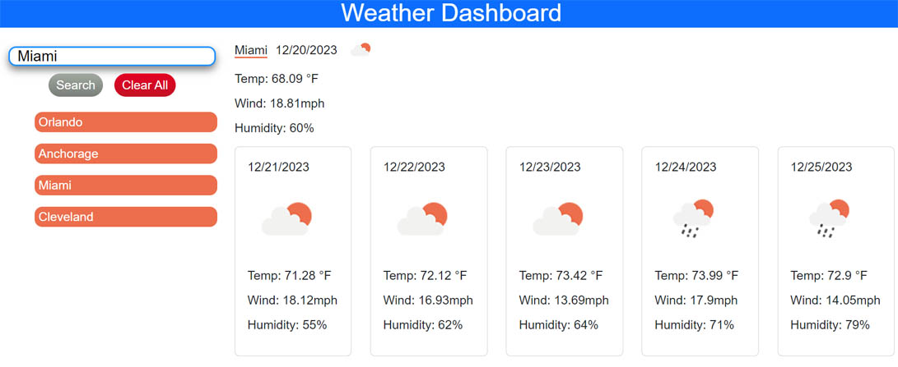

# Weather app OSU Bootcamp challenge 6

## Description

This project challenged me to use api data in html page..

During this project I learned how to:

- fetch an api from a website.
- fetch 2 api's at the same time.
- work with an api-key.
- access data of an api-object.
- add search capabilities for an api object.
- output api data to a html page.
- use stringify and parse with json objects.
- declare an object and save to local storage.

## Link to website

https://woestyn101.github.io/myweather_app/

## Installation (N/A)

## Usage

The code can be used to review how to fetch api date from
a website and use it on with search capabilites for a project.

## Screenshot of website

## Credits: Resources used

I used and modified code from the following resources:

https://www.youtube.com/watch?v=MIYQR-Ybrn4

https://www.youtube.com/watch?v=nGVoHEZojiQ

https://www.youtube.com/watch?v=cuEtnrL9-H0

https://www.w3schools.com/jsref/jsref_includes_array.asp

https://www.w3schools.com/howto/howto_js_trigger_button_enter.asp

https://stackoverflow.com/questions/40981040/using-a-fetch-inside-another-fetch-in-javascript

## License

MIT
